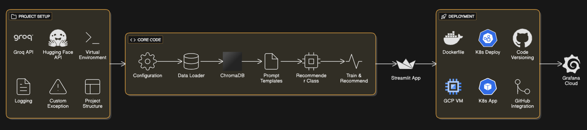
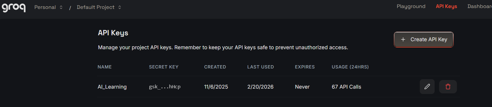
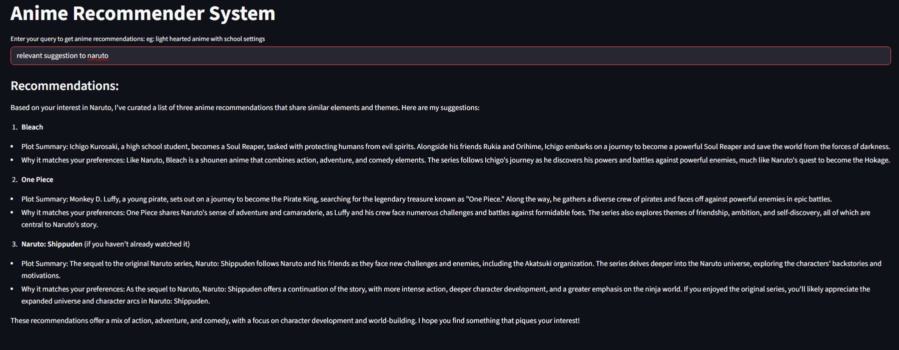

# AIOPS Project Documentation


## Documentation Index (quick links)

- Overview & beginner guide: [Overview.md](Overview.md)  
- Core module docs (in docs/src):
  - [data_loader.md](src/data_loader.md)
  - [vector_store.md](src/vector_store.md)
  - [prompt_template.md](src/prompt_template.md)
  - [pipeline.md](src/pipeline.md)
  - [recommender.md](src/recommender.md)
  - [llmops-k8s.md](src/llmops-k8s.md)
- Additional docs (top-level `docs/`):
  - [GCP_setup.md](GCP_setup.md)
  - [kubernetes.md](kubernetes.md)
  - [dockerfile.md](dockerfile.md)
  - [dockerfile_des.md](dockerfile_des.md)
  - `Project_setup.md` (screenshots of GCP → Minikube → Grafana → Git integration). Consider converting this `.docx` into `Project_setup.md` for easier viewing in the repo.

**Why this page exists:** This file is the project interface — a concise, beginner-friendly starting point that links to each subsystem's detailed documentation. Read this first, follow the step-by-step sections below, and jump to the linked docs for deep dives.

---

## Tech Stack

### AI & Machine Learning
- **Groq** - Large Language Model (LLM) for processing and generating recommendations
- **HuggingFace** - Embedding model for converting text data into numerical vectors. Since LLMs cannot directly interact with CSV files, this service handles: extracting data, chunking files, converting rows into documents, generating embeddings, and storing them in a vector database
- **LangChain** - Generative AI framework that facilitates seamless interaction between the application and the LLM

### Data & Storage
- **Chroma DB** - Local vector database for storing and retrieving embeddings generated from application data

### Frontend & UI
- **Streamlit** - Framework for building the user interface and web application frontend

### Container & Orchestration
- **Docker** - Containerization technology for packaging the application for deployment
- **Minikube** - Local Kubernetes cluster setup for development and testing environments
- **kubectl** - Command-line interface for managing and interacting with Kubernetes clusters (creating nodes, pods, etc.)

### Cloud & Infrastructure
- **GCP VM** (Google Cloud Platform Virtual Machine) - Cloud-based virtual machine for hosting and running the application
- **Grafana Cloud** - Monitoring and observability platform for Kubernetes clusters (includes 14-day free trial)

### Version Control
- **GitHub** - Source code management (SCM) platform for project versioning and collaboration

---

## Project Architecture & Workflow



### Phase 1: Project Setup

**API Configuration**
- Create two API keys: one for Groq account and another for HuggingFace account
- Store these credentials securely in environment variables (.env file)

### Phase 2: Core Implementation

**Configuration Module**
- Loads and manages environment variables containing API keys and model configurations
- Specifies which LLM and embedding models to use

**Data Loader** - [📄 Full Documentation](src/data_loader.md)
- Reads anime data from CSV files with proper encoding handling
- Validates that required columns (Name, Genres, Synopsis) exist
- Combines anime information (title, synopsis, genres) into a single text field optimized for embedding generation
- Removes incomplete records with missing values
- Saves processed data for downstream components
- **Input:** `data/anime_with_synopsis.csv` (~270 anime records from MyAnimeList)
- **Output:** Processed CSV with combined anime information ready for embedding

**Vector Store** - [📄 Full Documentation](src/vector_store.md)
- Converts processed anime text data into vector embeddings that capture semantic meaning
- Uses HuggingFace's `sentence-transformers/all-MiniLM-L6-v2` model to generate numerical vector representations (384-dimensional embeddings)
- Splits large text chunks into 1000-character segments for optimal embedding accuracy
- Stores all embeddings in Chroma vector database for fast similarity searches
- Enables persistent storage on disk so vectors can be reused without regeneration
- **Input:** Processed anime data with combined information
- **Output:** Vector database (Chroma DB) with 384-dimensional embeddings for semantic similarity matching
- **Use Case:** Powers intelligent anime search by finding similar anime based on semantic meaning rather than exact keyword matches

**Prompt Template** - [📄 Full Documentation](src/prompt_template.md)
- Defines the instructions and guidelines that control how the LLM (Groq) behaves when making recommendations
- Specifies exactly what information to include (anime title, plot summary, matching explanation)
- Enforces consistency by defining output format (numbered list of 3 recommendations)
- Includes safety constraints to prevent the LLM from fabricating non-existent anime or false information
- Acts as a bridge between retrieved context data and LLM processing
- **Input:** Context (retrieved anime data from vector DB) and user question
- **Output:** Structured LLM instructions that produce consistent, formatted recommendations
- **Use Case:** Ensures every recommendation follows the same high-quality, professional format with accurate information
- Defines instructions and guidelines for the LLM
- Determines how the model should format and structure its responses

**Recommender Class** - [📄 Full Documentation](src/recommender.md)
- Core recommendation engine that orchestrates anime suggestions using retrieval-augmented generation
- Combines vector database similarity search with LLM reasoning to produce personalized responses
- Uses Groq's mixtral model with temperature=0 for consistent, safe recommendations (no fabrications)
- Implements retrieval chain that automatically: searches vector DB → formats context → applies prompt → calls LLM
- Generates natural language explanations for why each recommended anime matches user preferences
- **Input:** User query (e.g., "action anime with deep plot")
- **Process:** Retrieve similar anime → format with prompt → LLM generates response
- **Output:** 3 anime recommendations with plot summaries and personalized explanations
- **Use Case:** Powers the final recommendation delivery to end users through the web interface
- Core recommendation engine that processes user queries
- Implements the recommendation logic and algorithms

**Training & Recommendation Pipeline** - [📄 Full Documentation](src/pipeline.md)
- Automates the complete data processing workflow from raw CSV to ready-to-use vector database
- Orchestrates three sequential operations: data loading, text processing, and embedding generation
- Handles cross-platform file path resolution so it works regardless of where the script is run from
- Implements robust error handling with detailed logging at each processing step
- Creates persistent vector database (Chroma DB) for fast similarity-based anime searches
- **Input:** Raw anime CSV file (`anime_with_synopsis.csv`)
- **Process:** Validates → Combines fields → Creates embeddings → Stores in database
- **Output:** Vector database (chroma_db/) ready for recommendation queries
- **Use Case:** One-time setup to prepare the system; can be re-run to update with new anime data
- Trains the recommendation system using loaded data converted to vectors
- Processes user queries and returns personalized recommendations
- Handles real-time inference and response generation

**Streamlit Application**
- Web-based user interface for interacting with the recommendation system
- Allows users to query and receive recommendations

### Phase 3: Deployment

**Containerization with Docker** - [📄 Full Documentation](src/dockerfile.md)
- Packages the entire application with all dependencies into a reusable container image
- Ensures consistent behavior across different machines (development, testing, production)
- Simplifies deployment by eliminating "it works on my machine" problems
- Creates isolated environments where Python, installed packages, and application code run without interference
- **Input:** Application code + requirements.txt + Dockerfile
- **Process:** Build image → Create containers → Expose ports → Run application
- **Output:** Container image ready to deploy anywhere Docker is installed
- **Use Case:** Deploy to cloud platforms, share with team members, ensure reproducible environments

**Kubernetes Deployment** - [📄 Full Documentation](kubernetes.md)
- Orchestration platform that automates deployment, scaling, and management of containerized applications
- Key concepts: Clusters, Nodes, Pods, Deployments, Services
- Provides self-healing (restarts failed containers), auto-scaling, and rolling updates
- **Input:** Docker image + Kubernetes manifest (YAML configuration)
- **Process:** Define desired state → Kubernetes maintains that state → Auto-scaling and recovery
- **Output:** Highly available application across multiple replicas and machines
- **Use Case:** Production deployments requiring reliability, scaling, and zero-downtime updates

**Kubernetes Manifest (llmops-k8s.yaml)** - [📄 Full Documentation](src/llmops-k8s.md)
- Single YAML file defining Deployment and Service for the application
- **Deployment section:** Defines how many replicas, which image, environment variables via secrets
- **Service section:** LoadBalancer type that exposes app externally and routes traffic to pods
- **Secret management:** API keys injected securely into cluster instead of being in .env files
- **Input:** Docker image (llmops-app:latest) + Secret credentials
- **Process:** 1 replica pod created → LoadBalancer service exposes on port 80 → Routes to container port 8501
- **Output:** Accessible web application at service IP/DNS
- **Use Case:** Define complete deployment in version-controlled YAML file for consistency across environments

**Cloud Infrastructure Setup**
- **GCP VM Installation**: Sets up the virtual machine with three essential components:
  1. **Docker Engine** - Required for running containerized applications; serves as the foundation for Kubernetes
  2. **Minikube** - Creates a local Kubernetes cluster on the VM for orchestration
  3. **kubectl** - Enables command-line interaction with the Kubernetes cluster

**Security & API Management**
- **Code Versioning**: API keys are never exposed in version control
- **Kubernetes Injection**: API keys and secrets are securely injected into the Kubernetes cluster at runtime, maintaining code safety and compliance

**GitHub Integration**
- Automated pipeline that integrates with your repository
- Workflow: Code is pushed to GitHub → Docker image is built from Dockerfile → Application is deployed using Kubernetes manifests → Live application is created and updated

### Phase 4: Monitoring & Observability

**Grafana Cloud**
- Monitors the running Kubernetes cluster in real-time
- Provides visibility into:
  - Number of active nodes
  - Service status and health
  - Active deployments and replicas
  - Resource utilization and performance metrics
- Eliminates the need for manual VM monitoring

---

---

## Phase 1: Development Environment Setup

### Creating Virtual Environment

Create an isolated Python environment to manage project dependencies independently:

```bash
python -m venv venv
```

**What this does:**
- Creates a new virtual environment named `venv` in the current folder
- Isolates project dependencies from system Python


### Activating Virtual Environment

Activate the virtual environment to use isolated Python:

```bash
venv\Scripts\activate
```

**Post-activation prompt:**
```
(venv) D:\Projects\AIOPS\Anime_Recommender>
```

The `(venv)` prefix indicates the virtual environment is active.

---

## Phase 2: API Configuration & Setup

### Groq API Key

**Purpose:** LLM API for generating recommendations

**Setup Steps:**
1. Visit: [Groq Console](https://console.groq.com/keys)
2. Sign up or log in to your Groq account
3. Navigate to API Keys section
4. Create a new API key
5. Copy and save the key securely



### HuggingFace API Key

**Purpose:** Embedding model for converting text to vectors

**Setup Steps:**
1. Visit: [HuggingFace Tokens](https://huggingface.co/settings/tokens)
2. Click on your profile picture in the top-right corner
3. Select "Access tokens" from the dropdown menu
4. Create a new token
5. Copy and save the token securely


### Environment File (.env) Creation

Store your API keys securely in a `.env` file (add to `.gitignore` to prevent exposure):


**.env File Location:** `Anime_Recommender/.env`

**Format:**
```
GROQ_API_KEY=your_groq_key_here
HUGGINGFACE_API_KEY=your_huggingface_token_here
```

---

## Phase 3: Data Preparation

### Dataset Location

**Path:** `Anime_Recommender/data/anime_with_synopsis.csv`

**Data Source:** My Anime List database

**How it works:**
- Raw anime data containing titles, genres, and synopses
- Recommendation engine uses genre and synopsis similarity
- Example: Users who like "Naruto" often enjoy "Black Clover" or "Bleach"
- Similar recommendations apply across the anime catalog

**Data Processing:**
- CSV file is loaded and processed by the Data Loader
- Text is converted into embeddings via HuggingFace
- Embeddings are stored in Chroma DB for fast similarity search

---

## Phase 4: Project Structure & Dependencies

### requirements.txt

**Location:** `Anime_Recommender/requirements.txt`

**Purpose:** Lists all Python libraries required for the project

**Install dependencies:**
```bash
pip install -r requirements.txt
```

### Project Directory Structure

```
Anime_Recommender/
├── src/
│   ├── __init__.py
│   ├── config/
│   │   ├── __init__.py
│   │   └── config.py          # API and database configuration
│   └── utils/
│       ├── __init__.py
│       ├── logger.py           # Logging utilities
│       └── custom_exception.py # Custom exception handling
├── data/
│   └── anime_with_synopsis.csv
├── requirements.txt
├── setup.py
├── .env                        # API keys (add to .gitignore)
└── .gitignore
```

**Directory Descriptions:**
- **config/** - Manages API credentials and database connection setup
- **utils/** - Contains helper functions and utilities
  - `logger.py` - Centralized logging configuration
  - `custom_exception.py` - Custom exception classes for error handling
- **data/** - Dataset files for training and recommendations
- `.env` - Environment variables (API keys) - **Never commit to version control**

### setup.py Installation

**Location:** `Anime_Recommender/setup.py`

**Installation command:**
```bash
pip install -e .
```

**What this does:**
- Reads `setup.py` configuration
- Installs the project in editable mode (`-e` flag)
- Automatically installs all dependencies from `requirements.txt`
- Allows code changes to take effect immediately without reinstalling


---

## Phase 5: Configuration Module

### config.py Setup

The `config.py` module centralizes all configuration management:

**Location:** `Anime_Recommender/src/config/config.py`

**Responsibilities:**
- Load environment variables from `.env` file
- Manage API keys for Groq and HuggingFace
- Configure database connection parameters (Chroma DB)
- Store model configurations and paths
- Provide centralized access to all settings

**Example structure:**
```python
import os
from dotenv import load_dotenv

load_dotenv()

GROQ_API_KEY = os.getenv("GROQ_API_KEY")
HUGGINGFACE_API_KEY = os.getenv("HUGGINGFACE_API_KEY")
CHROMA_DB_PATH = "data/chroma_db"
EMBEDDING_MODEL = "sentence-transformers/all-MiniLM-L6-v2"
```

---

## 📚 Detailed Documentation

This **Overview.md** serves as an index for recreating the project from scratch. For detailed explanations of specific components, refer to the documentation files organized by project structure:

### Core Components

| Component | Documentation | Purpose |
|-----------|---------------|---------|
| **Data Loader** | [docs/src/data_loader.md](src/data_loader.md) | Load & process anime data from CSV, validate structure, prepare for embeddings |
| **Logger** | [docs/utils/LOGGER.md](utils/LOGGER.md) | Centralized logging configuration and usage |
| **Custom Exception** | [docs/utils/custom_exception.md](utils/custom_exception.md) | Application-specific error handling with detailed debugging info |
| **Setup & Config** | [docs/SETUP.md](SETUP.md) | Package installation, configuration, and environment setup |

### Documentation Structure

The documentation is organized to mirror the project folder structure for easy navigation:

```
docs/
├── Overview.md                    ← You are here (Project index)
├── SETUP.md                       ← Setup and installation guide
├── src/
│   └── data_loader.md             ← Data loading and processing
├── utils/
│   ├── LOGGER.md                  ← Logging utilities
│   └── custom_exception.md        ← Exception handling
└── (More docs coming...)
    └── embedding_generator.md     ← Vector generation
    └── recommender.md             ← Recommendation engine
    └── streamlit_app.md           ← Web UI
```

### How to Use This Documentation

1. **For Project Recreation:** Start with [Overview.md](Overview.md) (this file)
   - Follow Phase 1-5 to set up the entire project
   - Contains all setup, API configuration, and installation steps

2. **For Component Details:** Navigate to specific docs based on component
   - Need to understand data loading? → See [docs/src/data_loader.md](src/data_loader.md)
   - Need logging setup? → See [docs/utils/LOGGER.md](utils/LOGGER.md)
   - Need error handling? → See [docs/utils/custom_exception.md](utils/custom_exception.md)

3. **For Implementation Examples:** Each documentation file includes:
   - Usage patterns with code examples
   - Integration examples with other components
   - Best practices and troubleshooting
   - Common issues and solutions

### Quick Links

- 🚀 **Getting Started:** [Phase 1: Development Environment Setup](Overview.md#phase-1-development-environment-setup)
- 🔑 **API Setup:** [Phase 2: API Configuration & Setup](Overview.md#phase-2-api-configuration--setup)
- 📊 **Data Preparation:** [Phase 3: Data Preparation](Overview.md#phase-3-data-preparation)
- 📦 **Dependencies:** [Phase 4: Project Structure & Dependencies](Overview.md#phase-4-project-structure--dependencies)
- ⚙️ **Configuration:** [Phase 5: Configuration Module](Overview.md#phase-5-configuration-module)

### Documentation Roadmap

**Completed:**
- ✅ Overview.md (Project Index)
- ✅ docs/SETUP.md (Setup Guide)
- ✅ docs/src/data_loader.md (Data Loading)
- ✅ docs/utils/LOGGER.md (Logging)
- ✅ docs/utils/custom_exception.md (Exception Handling)

**Coming Soon:**
- 🔄 docs/src/embedding_generator.md
- 🔄 docs/src/recommender.md
- 🔄 docs/src/prompt_template.md
- 🔄 docs/app/streamlit_app.md
- 🔄 docs/deployment/docker.md
- 🔄 docs/deployment/kubernetes.md

---

**Last Updated:** February 23, 2026  
**Author:** Ladi Asrith  
**Repository:** [AIOPS-LLMOPS-Projects](https://github.com/Asrith-Ladi/AIOPS-LLMOPS-Projects)


# Data_loader.py

create a class and do operations to clean the csv by keeping the req cols, anim name, genre and synopsis

# Result

> streamlit run app/app.py

